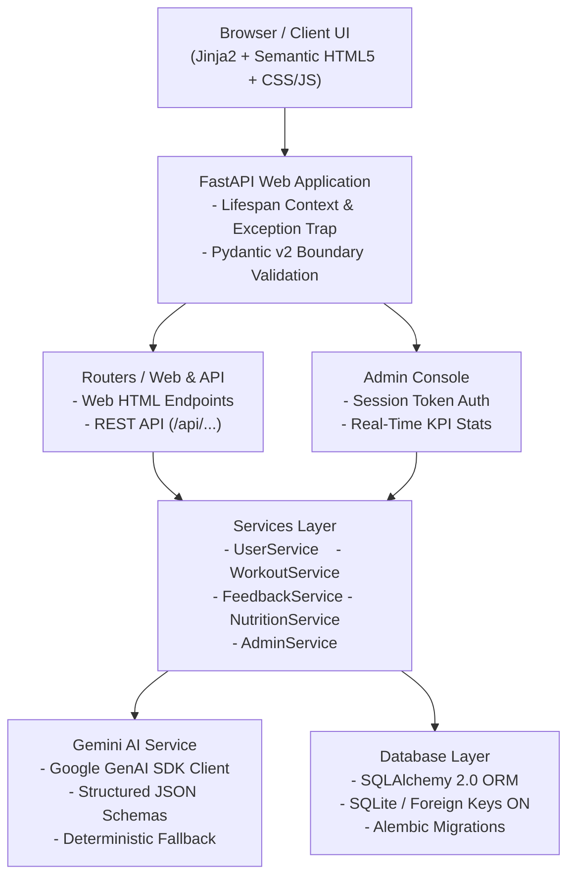

# FitBuddy
An AI fitness plan generator using Gemini models.

## Key Features
1. **Fitness Profile Engine** — Captures user age, weight, target goals (*Weight Loss*, *Muscle Gain*, *General Wellness*), workout intensity (*Low*, *Medium*, *High*), and training experience level.
2. **7-Day Structured AI Workout Generator** — Gemini AI generates a 7-day microcycle with daily focus areas, dynamic warm-ups, structured exercise schemes (sets, reps, rest intervals, form cues), cool-down stretches, and daily recovery protocols.
3. **Interactive Plan Refinement Feedback Loop** — Users submit natural language requests (e.g., *"More focus on cardio"*, *"Include more rest days"*) to remodel routines, with version increments that preserve historical baselines.
4. **Instant Nutrition & Recovery Guidance** — Delivers goal-tailored dietary tips, hydration rules, protein distribution guidelines, and sleep hygiene recommendations.
5. **Secure Administrative Control Center** — A protected console featuring PBKDF2-HMAC-SHA256 password hashing, HMAC-SHA256 signed session cookies, real-time KPI metrics, user inspection, and cascading account deletion.
6. **Robust AI Resilience & Offline Fallbacks** — Handles missing API keys, network outages, rate limits, and quota exhaustion gracefully, falling back to high-fidelity deterministic plans.
7. **Production Architecture** — Enforces strict separation of concerns (Core, Database, Models, Schemas, Routers, Services, Prompts, Templates, Static Assets) with 100% test coverage across all workflows.

## Architecture Flow


## Tech Stack
- **FastAPI Framework Knowledge:**  [FastAPI Documentation](https://devdocs.io/fastapi/)
- **Gemini API Familiarity:**  [Google Generative AI Documentation](https://ai.google.dev/)
- **HTML, CSS, and Jinja2 Template Skills:**  [W3Schools HTML/CSS/Jinja2 Tutorials](https://www.w3schools.com/)
- **Python Programming Proficiency:**  [Python Official Docs](https://docs.python.org/3/)
- **Version Control with Git:**  [Git Documentation](https://git-scm.com/doc)
- **SQLAlchemy and SQLite Basics:**  SQLAlchemy Docs
- **Environment Setup (pip, virtualenv, or conda):**  [Virtualenv Guide](https://virtualenv.pypa.io/en/latest/)
- **Uvicorn ASGI Server:**  [Uvicorn Docs](https://www.uvicorn.org/)

## Get Started
### ### 1. Clone & Setup Environment

```bash
git clone https://github.com/pragalatha2008/FitBuddy # clone repo
cd FitBuddy 

# create virtual environment
python -m venv .venv

# activate that environment
.venv\Scripts\Activate.ps1 # windows powershell
# or
source .venv/bin/activate # linux / macOS:
```

### 2. Install Dependencies

```bash
pip install -r requirements.txt
```

### 3. Configure Environment Variables

Copy `.env.example` to `.env`:

```bash
cp .env.example .env
```

Configure the settings inside `.env`:

```ini
APP_NAME=FitBuddy
ENVIRONMENT=development
DEBUG=True
HOST=127.0.0.1
PORT=8000
SECRET_KEY=fitbuddy-dev-secret-key-change-in-production-1234567890

# Database
DATABASE_URL=sqlite:///./fitbuddy.db

# Google Gemini API (Optional for offline testing; required for live Gemini calls)
GEMINI_API_KEY=your_gemini_api_key_here
GEMINI_WORKOUT_MODEL=gemini-2.5-flash
GEMINI_FAST_MODEL=gemini-2.5-flash

# Administrator Credentials
ADMIN_USERNAME=admin
ADMIN_PASSWORD=adminpassword123
```

> **Note**: If `GEMINI_API_KEY` is omitted or unavailable, FitBuddy seamlessly utilizes its built-in expert-verified deterministic workout generator.

### 4. Initialize Database & Run Migrations

```bash
# Apply Alembic database migrations
python -m alembic upgrade head
```

### 5. Launch the Application

```bash
# Option A: Run via runner script
python run.py

# Option B: Run directly via Uvicorn
uvicorn app.main:app --reload --port 8000
```

Open your browser and visit:
- **Application UI**: [http://127.0.0.1:8000](http://127.0.0.1:8000)
- **Interactive Swagger API Docs**: [http://127.0.0.1:8000/docs](http://127.0.0.1:8000/docs)
- **ReDoc API Documentation**: [http://127.0.0.1:8000/redoc](http://127.0.0.1:8000/redoc)
- **Admin Control Console**: [http://127.0.0.1:8000/admin/login](http://127.0.0.1:8000/admin/login) *(Default: `admin` / `adminpassword123`)*

## REST API Endpoints Reference

| Method | Endpoint | Description | Protected |
|---|---|---|---|
| `GET` | `/health` | Root application health check | No |
| `GET` | `/api/health` | Database & Gemini service status | No |
| `POST` | `/api/users` | Create user profile with validation | No |
| `GET` | `/api/users/{user_id}` | Retrieve user profile by ID | No |
| `GET` | `/api/users` | Paginated listing of user profiles | No |
| `POST` | `/api/workouts/generate` | Generate 7-day plan via Gemini AI | No |
| `GET` | `/api/workouts/{plan_id}` | Retrieve workout plan by ID | No |
| `GET` | `/api/workouts/user/{user_id}` | Retrieve all workout plans for a user | No |
| `POST` | `/api/workouts/{plan_id}/feedback` | Submit feedback & refine plan | No |
| `GET` | `/api/workouts/{plan_id}/feedback` | List feedback revisions for a plan | No |
| `POST` | `/api/nutrition/tip` | Generate goal-based nutrition tip | No |
| `GET` | `/api/nutrition/tips` | List recent nutrition tips | No |
| `GET` | `/api/admin/metrics` | System statistics and user analytics | **Yes (Admin)** |

## Security Best Practices

1. **Secrets Management** — API keys and passwords are kept out of source code and centralized in `.env`.
2. **Password Protection** — Passwords are hashed with PBKDF2-HMAC-SHA256 using cryptographically generated salts.
3. **Session Security** — Admin sessions use HMAC-SHA256-signed, HTTP-only cookies with `SameSite=Lax`.
4. **Input Sanitization** — Pydantic v2 enforces server-side validation, blocking prompt injection, invalid types, and out-of-boundary payloads.
5. **Safe Error Handling** — Internal stack traces are masked when running in production mode.

## Health & Safety Medical Disclaimer

FitBuddy is an artificial intelligence-driven fitness planning and wellness education application. It provides generalized training routines and dietary guidance based on user-provided inputs. **FitBuddy is NOT a medical organization and does NOT provide medical diagnosis, treatment, or clinical advice.** Users should always consult with a licensed physician or healthcare provider before undertaking any new physical exercise or dietary regimen. Discontinue exercise immediately if you experience dizziness, shortness of breath, or sharp pain.
